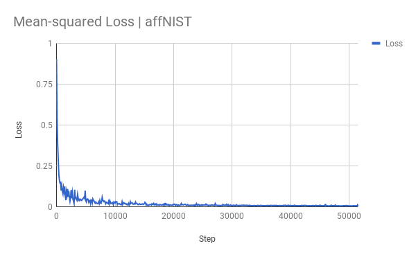
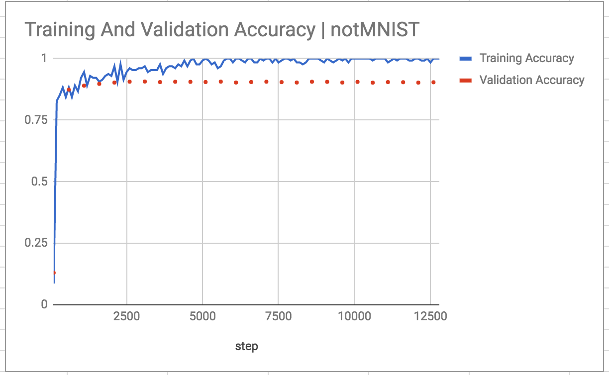
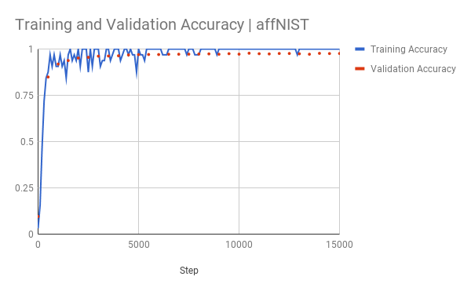

# Capsule Network - notMNIST and affNIST Dataset
A Tensorflow implementation of CapsNet on notMNIST and affNIST dataset based on Geoffrey Hinton's paper [Dynamic Routing Between Capsules](https://arxiv.org/abs/1710.09829)

Note - This is implemented as a project for the subject CSE676-Deep Learning at the University of Buffalo.
## Datasets ##
1) [notMNIST](http://yaroslavvb.blogspot.com/2011/09/notmnist-dataset.html) which contatins letters from 'A' to 'J' and can be used for validating if a given algorithm is generic and can work outside the MNIST dataset.

2) The [affMNIST](http://www.cs.toronto.edu/~tijmen/affNIST/) dataset for machine learning is based on the well-known MNIST dataset. MNIST, however, has become quite a small set, given the power of today's computers, with their multiple CPU's and sometimes GPU's. affNIST is made by taking images from MNIST and applying various reasonable affine transformations to them. In the process, the images become 40x40 pixels large, with significant translations involved, so much of the challenge for the models is to learn that a digit means the same thing in the upper right corner as it does in the lower left corner. 

Research into "capsules" has suggested that it is beneficial to directly model the position (or more general "pose") in which an object is found. affNIST aims to facilitate that by providing the exact transformation that has been applied to make each data case, as well as the original 28x28 image. This allows one to train a model to normalize the input, or to at least recognize in which ways it has been deformed from a more normal image. 

[](https://opensource.org/licenses/Apache-2.0)


> 1.Capsule - A new version neural unit(vector in vector out, not scalar in scalar out)
> 2.Routing algorithm - similar to attention mechanism

## Requirements
- Python
- NumPy
- [Tensorflow](https://github.com/tensorflow/tensorflow) (I'm using 1.3.0)
- tqdm (for displaying training progress info)
- scipy (for saving images)
- matplotlib

## Usage
**Step 1.** Download this repository with ``git`` or click the [download ZIP](https://github.com/naturomics/CapsNet-Tensorflow/archive/master.zip) button.
```
$ git clone https://github.com/Mohit-Ak/CapsNet_notMNIST_affNIST.git
$ cd CapsNet_notMNIST_affNIST
```

**Step 2a.** Download the [notMNIST](https://github.com/davidflanagan/notMNIST-to-MNIST.git)

- a) Unzip the same into the data/notMNIST

```
$ mkdir -p data/notMnist
$ gunzip data/notMnist/*.gz
```
**Step 2b.** [or] Download the [affNIST](http://www.cs.toronto.edu/~tijmen/affNIST/)

- a) Unzip the training and validation batches into the data/affNIST/train
- b) Unzip the same into the data/affNIST/test

```
$ mkdir -p data/notMnist
$ gunzip data/notMnist/*.gz
```

**Step 3.** Start the training(Using the notMNIST dataset by default):

```
$ python main.py
$ # or training for affNIST dataset
$ python main.py --dataset affNIST
```

**Step 4.** Calculate test accuracy

```
$ python main.py --is_training=False
$ # for fashion-mnist dataset
$ python main.py --dataset affNIST --is_training=False
```


> **Note:** The default parameters of batch size is 128 but since affNIST is 40*40 it does not run on Gtx1070i unless the batch size is brought down to 32.

## Results

Dataset | notMNIST | affNIST 
:-----|:----:|:----:
Validation accuracy | 90.3% | 97.7%

- Trained Model Downloads : https://drive.google.com/drive/folders/1vU5jQ0lTV-D5Yyztm8eAi4sKoFtLBrzj?usp=sharing

- Training Loss





- Training and Validation Accuracy




### Reference
- [naturomics/CapsNet-Tensorflow](https://github.com/naturomics/CapsNet-Tensorflow): Capsule Network Implementation
- [XifengGuo/CapsNet-Keras](https://github.com/XifengGuo/CapsNet-Keras): referred for some code optimizations
